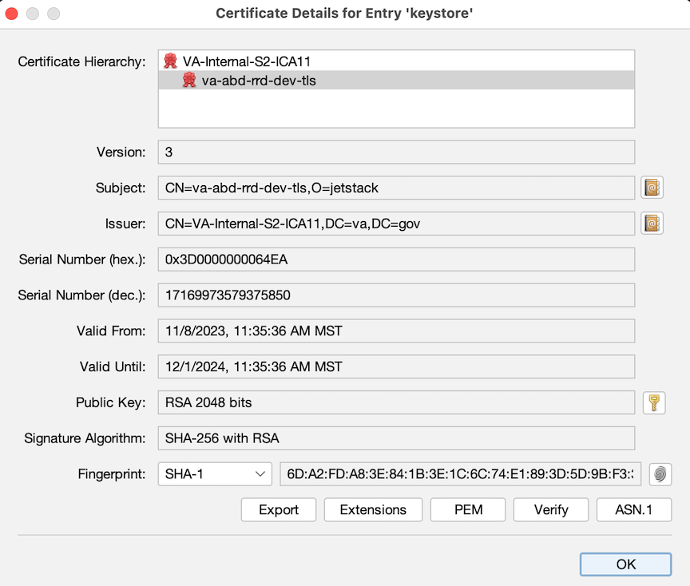
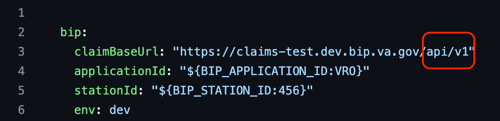

# svc-bip-api: a VRO Shared Microservice Offering

# [BIP as a Shared Microservice](https://github.com/department-of-veterans-affairs/abd-vro/issues/1594)
Originally integrated as one of RRD's core services, BIP would be split out into a standalone service becoming one of VRO's share microservices ([1594](https://github.com/department-of-veterans-affairs/abd-vro/issues/1594)).


# [VRO Shared Microservice Specification](https://github.com/department-of-veterans-affairs/abd-vro/wiki/Software-Conventions#service-microservice-container-module)
- :white_check_mark: Standard microservice benefits: Scalable, Decoupled, Stateless, Idempotent
- :white_check_mark: Shared: providing cross-domain base operations shared across domains
- :question: Dogmatic use of MessageQueue:
  * Rightfully Questioned 
  * OpenSource Frameworks have made REST APIs Ubiquitous (FastAPI, Flask, Express, etc) 
  * There is nothing more modern nor easy to manage: REST APIs 
  * Provide Life-like Mock Services - Simplifying local development


What We Mean When Talking about: 
# BIP in VRO 

- [Benefits Integration Platform](https://github.com/search?q=org%3Adepartment-of-veterans-affairs+bip&type=repositories)
- [BIP VetServices Claims API](https://github.com/department-of-veterans-affairs/bip-vetservices-claims)
- [Subset of Functions, Including:](https://github.com/department-of-veterans-affairs/abd-vro/blob/develop/svc-bip-api/src/main/java/gov/va/vro/bip/service/IBipApiService.java)
  * getClaimDetails
  * putClaimLifecycleStatus
  * getClaimContentions
  * createClaimContentions
  * updateClaimContentions
  * cancelClaim
  * putTempStationOfJurisdiction

### [1534](https://github.com/department-of-veterans-affairs/abd-vro/issues/1534)
Make BIP a Standalone Service (May-June)

### [1777](https://github.com/department-of-veterans-affairs/abd-vro/issues/1777)
BipApi Loose Ends (June-July)

### [1974](https://github.com/department-of-veterans-affairs/abd-vro/issues/1974)
Get BIP API microservice and documentation ready for partner team use (July-August)

### [2098](https://github.com/department-of-veterans-affairs/abd-vro/issues/2098)
Partner Team wants to call cancel on svc-bip-api, so I can remove an unnecessary claim record

# Configuration


BIP API Calls resulting in: 
```notes
BipRequestErrorHandler
https://localhost:20300/claims/9666958
```

### ClaimBaseUrl Not Set

### Spring Configuration Conventions

```notes
Profile specific configuration settings aren't taking effect
```
### [Turns out](https://dsva.slack.com/archives/C04QLHM9LR0/p1702334971406419)

```yaml
spring:
  profiles:
    # See https://github.com/department-of-veterans-affairs/abd-vro/wiki/Configuration-settings#vros-use-of-spring-profiles
    active: ${ENV:default}
```

### [wiki documentation](https://github.com/department-of-veterans-affairs/abd-vro/wiki/Configuration-settings#vros-use-of-spring-profiles) makes good recommendations for spring configuration profiles 

```notes
follow standards from wiki
simplify Spring conventions where possible
```

# Mutual TLS Authentication

### [Certificate Chain Invalid](https://github.com/department-of-veterans-affairs/abd-vro/wiki/BIP-APIs#certificates)

```notes
wiki docs are wrong but very convincing
```

### [LHDI Self Service Certificates](https://animated-carnival-57b3e7f5.pages.github.io/container-platform/cert-management/)

### Intermediate Certificate Authorities

```notes
Testing with CURL: helpful but not sufficient
```

### New Node.js client  Mutual TLS Auth 




# [Secret Management](obsidian://open?vault=new-vault&file=work%2Fnava%2Farchitecture%2FResolving%20the%20Vault%20to%20K8%20Secret%20Injection%20Dilemma)


### Vault Agent Sidecar


### Better Solutions with Vault


# Problems


# Final Solution





