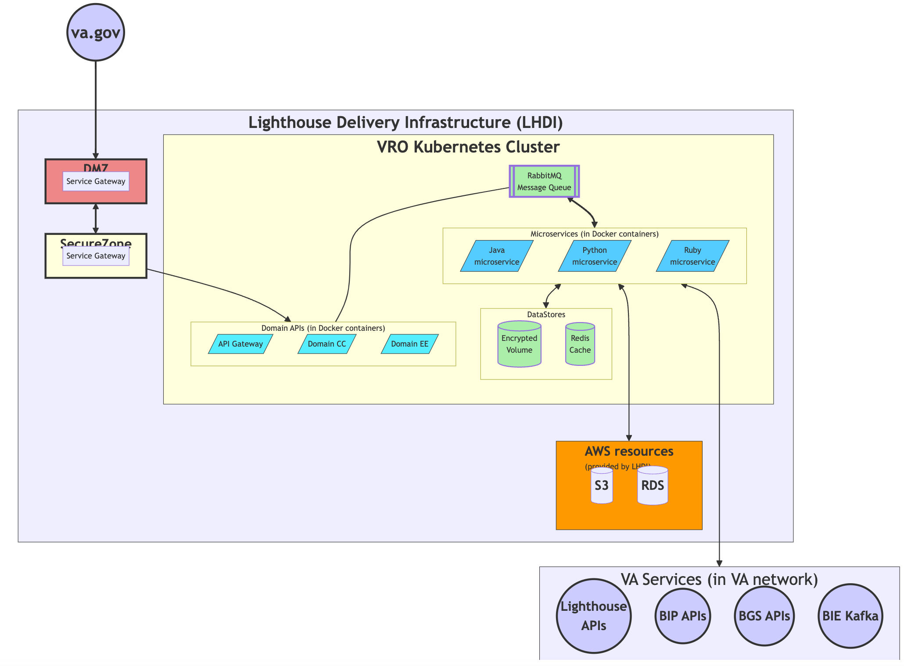
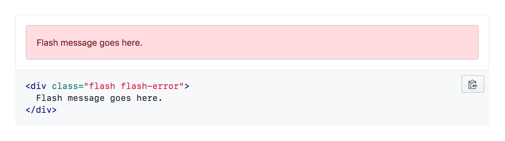
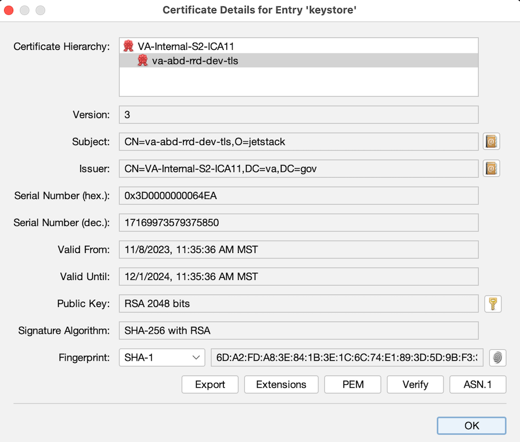
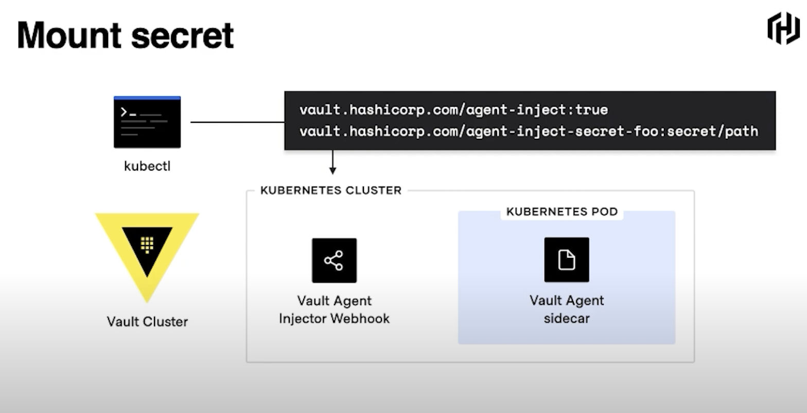
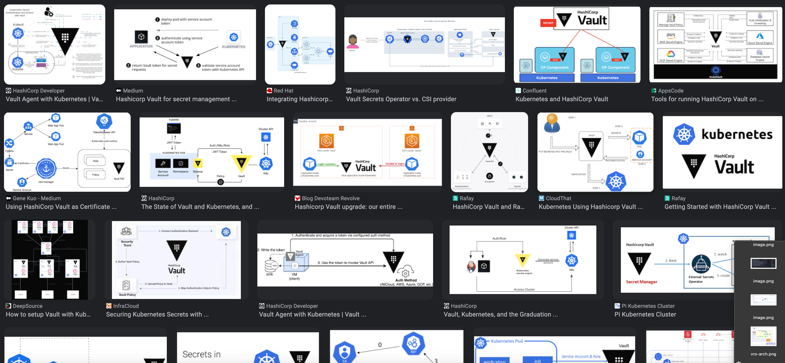
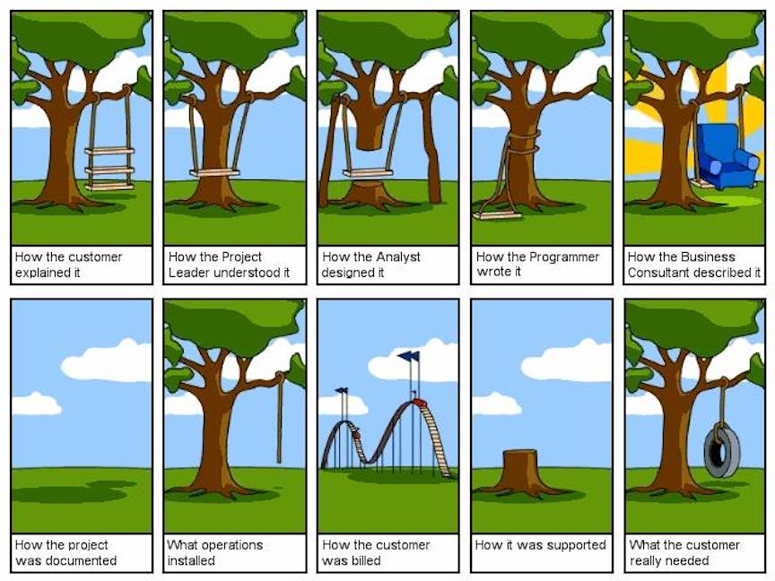
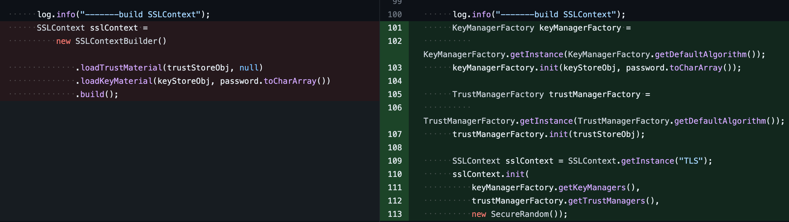
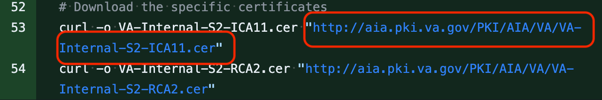
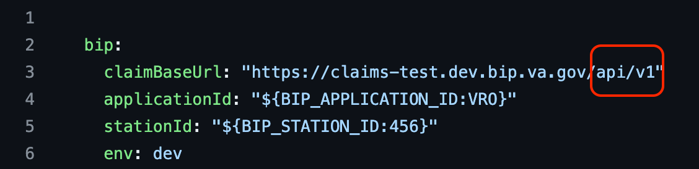

import { Image } from 'mdx-deck'
import { FullScreenCode } from 'mdx-deck/layouts'
import QuoteLayout from './QuoteLayout'
export { default as theme } from './theme'

# svc-bip-api: a VRO Shared Microservice Offering

---

# Erik Nelsestuen

Cross Benefits Crew - Virtual Regional Office

@nelsestu

---

# [BIP as a Shared Microservice](https://github.com/department-of-veterans-affairs/abd-vro/issues/1594)



---

# Shared Microservices are..

[Scalable, Decoupled, Stateless, Idempotent](https://github.com/department-of-veterans-affairs/abd-vro/wiki/Software-Conventions#service-microservice-container-module)

---

# [1534](https://github.com/department-of-veterans-affairs/abd-vro/issues/1534)
make bip into a standalone service

[IBipApiService.java](https://github.com/department-of-veterans-affairs/abd-vro/blob/develop/svc-bip-api/src/main/java/gov/va/vro/bip/)service/IBipApiService.java

---

# [1777](https://github.com/department-of-veterans-affairs/abd-vro/issues/1777)
BipApi Loose Ends

---

# [1974](https://github.com/department-of-veterans-affairs/abd-vro/issues/1974)
Get BIP API microservice and documentation ready for partner team use

---

# [1974](https://github.com/department-of-veterans-affairs/abd-vro/issues/2279)

---

# Configuration


BipRequestErrorHandler

https://localhost:20300/claims/9666958

---

# Update the configuration setting

```notes
Still doesn't work
```

---

# [Turns out](https://dsva.slack.com/archives/C04QLHM9LR0/p1702334971406419)

no configuration settings are populating... 😅

---

Spring Profile Missing for BIP:

```yaml
spring:
  profiles:
    # See https://github.com/department-of-veterans-affairs/abd-vro/wiki/Configuration-settings#vros-use-of-spring-profiles
    active: ${ENV:default}
```

---

# Spring Configuration profiles

[wiki documentation](https://github.com/department-of-veterans-affairs/abd-vro/wiki/Configuration-settings#vros-use-of-spring-profiles)

```notes
and it's a monolith
```

---

# [Certificate Chain Invalid](https://github.com/department-of-veterans-affairs/abd-vro/wiki/BIP-APIs#certificates)

```notes
wiki is wrong but very convincing
```

---

# [LHDI Self Service Certificates](https://animated-carnival-57b3e7f5.pages.github.io/container-platform/cert-management/)

---

# Intermediate Certificate Authorities

---

Testing with CURL

```bash
Lots of classes in the markup.
```
---



---

# [Secret Management](obsidian://open?vault=new-vault&file=work%2Fnava%2Farchitecture%2FResolving%20the%20Vault%20to%20K8%20Secret%20Injection%20Dilemma)

---

Vault Agent Sidecar


---

Better Solutions with Vault


---

# Problems

---



---



---



---



---

### the end

---
